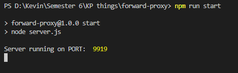
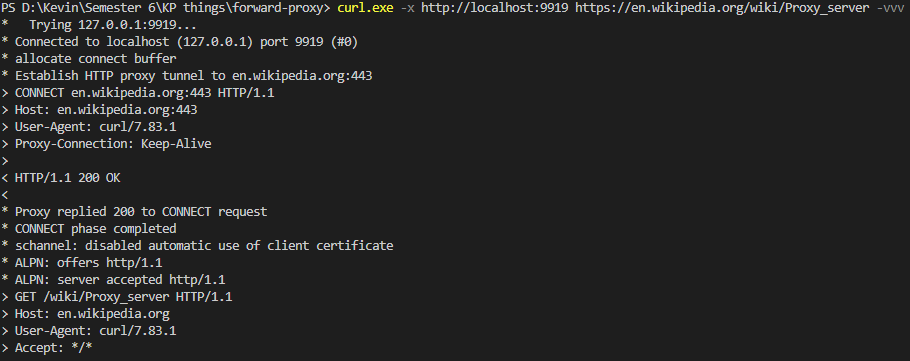
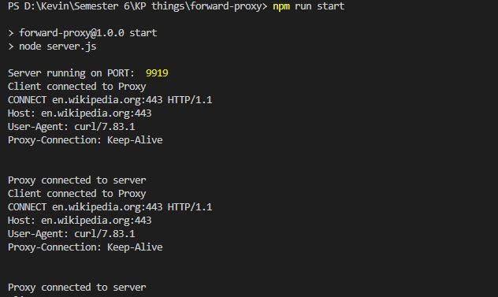
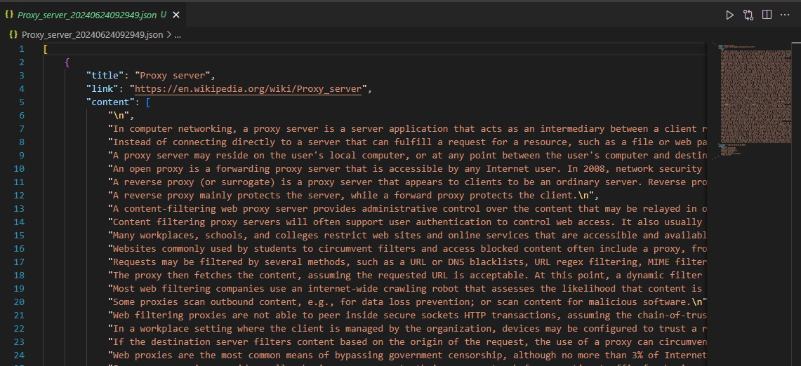
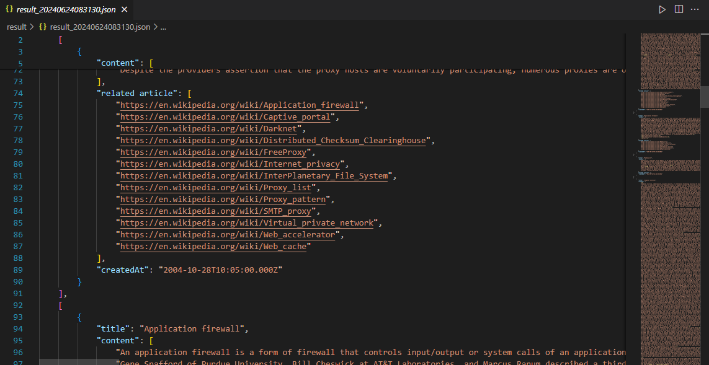

# Forward Proxy and Wikipedia Scraper

## Spesifikasi
### Forward Proxy
Forward proxy adalah sebuah batas yang berada di tengah user dan internet. Forward proxy server mengevaluasi request, mengambil aksi yang perlu dilakukan, dan mengarahkan request ke tujuan di sisi client. Proxy ini juga mengevaluasi dan memeriksa response, mengambil aksi yang perlu dilakukan, serta meneruskannya ke client jika response tersebut aman.

### Wikipedia Scraper
Sebuah program yang dapat digunakan untuk mengambil data dari suatu situs wikipedia tertentu. Pengguna akan diminta untuk memberikan argumen berupa judul artikel wikipedia. Program akan membuat sebuah file JSON yang berisi judul, _link_, konten, tanggal pembuatan, serta kategori dari artikel tersebut.

### Related Links Scraper dan Batasannya
Program ini adalah program scraper untuk mengambil _link-link_ terkait dari sekumpulan _link_ wikipedia yang diberikan. Program ini berjalan secara rekursif, yang berarti program juga mengambil data _link_ terkait dari _link-link_ yang sudah didapatkan sebelumnya. Batasan untuk program ini adalah program harus dihentikan di tengah dengan menekan `Ctrl+C` pada keyboard, agar data yang diambil tidak terlalu lama dan banyak. Tidak ada _link_ yang di-_scrape_ dua kali. File JSON berisi data tentang judul, konten, tanggal pembuatan, serta daftar _link_ artikel terkait.

## Cara Menjalankan Program
### Forward Proxy
- Menginstall Nodejs jika belum terdapat pada sistem komputer pada `https://nodejs.org/en/download/package-manager`
- Install nodemon dengan command 
```
npm i nodemon -D
```
- Jalankan forward proxy dengan command sebagai berikut
```
npm run start
```
- Buka terminal baru, coba akses sebuah link dengan perintah
```
curl -x http://localhost:9919 [your link] -vvv
```
misalkan
```
curl -x http://localhost:9919 https://en.wikipedia.org/wiki/Proxy_server -vvv
```
- Jika command di atas tidak bekerja, coba dengan command berikut ini
```
curl.exe -x http://localhost:9919 https://en.wikipedia.org/wiki/Proxy_server -vvv
```

### Wikipedia Scraper
- Install requirement terlebih dahulu dengan command
```
pip install requirements.txt
```
- Jalankan program dengan perintah
```
./run_scraper.sh [phrase]
```
, dengan phrase berupa judul artikel yang ingin diambil datanya. Contoh:
```
./run_scraper.sh "proxy server"
```

- Jika ingin menjalankan dengan forward proxy, masukkan command
```
./run_scraper.sh [phrase] [proxy url]
```
Contoh:
```
./run_scraper.sh "proxy server" "http://localhost:9919"
```
- Hasil _scraping_ data akan tersimpan dalam file JSON dengan nama yang mengandung judul artikel dan timestamp

### Related Links Scraper
- Jalankan program dengan perintah
```
python src/link_scraper.py [filename]
```
Contoh:
```
python src/link_scraper.py tes.txt
```

- Tekan `Ctrl+C` pada keyboard jika ingin menghentikan proses _scraping_

- Hasil scrape data akan tersimpan dalam file JSON bernama `result_[timestamp]`

## Screenshots
### Forward Proxy

Saat mulai menjalankan _forward proxy_<br>


Saat mengeksekusi _command_, mengembalikan _response_ HTTP 2xx <br>


Saat _command_ sudah dieksekusi <br>

### Wikipedia Scraper

Salah satu file hasil _scraping_ untuk _command_ `./run_scraper.sh "proxy server"`<br>

### Related Links Scraper

Salah satu file hasil _scraping_ untuk _command_ `python tes.txt`<br>